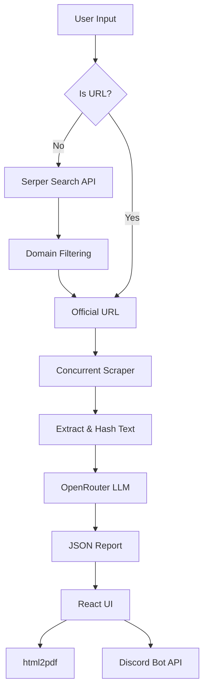

# 🚀 ReluAI Researcher: Autonomous Company Intelligence Engine


**ReluAI Researcher** is a production-grade, autonomous company research application built for the **Relu Consultancy AI & Automation Developer Hiring Challenge**. 

This system transforms a simple company name or URL into a highly structured, objective intelligence report. It leverages parallel web crawling, deduplication algorithms, and LLM reasoning to extract products, pain points, and competitors, all wrapped in a premium glassmorphism UI.

---

## 🌟 Key Engineering Features

- **Heuristic Domain Discovery**: Intelligently bypasses directory sites (Wikipedia, LinkedIn, G2, etc.) to discover and target the true official company domain.
- **Concurrent Deep Crawling**: Utilizes `Promise.allSettled` to crawl priority subpages (`/about`, `/products`, `/solutions`, etc.) in parallel, cutting data acquisition time by up to 70%.
- **Resilient Retry Logic**: Built-in Axios retry logic ensures transient network failures don't halt the entire research pipeline.
- **Context-Window Optimization**: A lightweight string-hashing algorithm prevents duplicate text from bloating the LLM prompt, ensuring high token efficiency.
- **Strict JSON Enforcement**: Advanced prompt engineering forces the LLM to output highly structured JSON without hallucinations, explicitly handling missing data.
- **Serverless Discord Integration**: Uses the Discord v10 REST API via Next.js API Routes to handle multipart form data, instantly pushing generated PDF reports to Discord channels.
- **Zero-Bloat PDF Generation**: Dynamic imports ensure `html2pdf.js` is only loaded client-side when requested, keeping the initial Next.js bundle lightning fast.

## 🏗 System Architecture



## 🛠 Tech Stack

- **Framework**: Next.js (App Router)
- **Language**: JavaScript (ES6+)
- **Styling**: Vanilla CSS Modules (Glassmorphism design language)
- **Data Acquisition**: Axios, Cheerio, Serper.dev
- **AI Processing**: OpenRouter (GPT-4o / Llama 3)
- **PDF Generation**: html2pdf.js
- **Icons**: Lucide React

## 🚀 Getting Started

### Prerequisites
- Node.js 18+
- npm or yarn
- OpenRouter API Key
- Serper.dev API Key
- *(Optional)* Discord Bot Token & Channel ID

### Installation
1. **Clone the repository:**
   ```bash
   git clone https://github.com/yourusername/ai-company-researcher.git
   cd ai-company-researcher
   ```
2. **Install dependencies:**
   ```bash
   npm install
   ```
3. **Environment Setup:**
   ```bash
   cp .env.example .env.local
   ```
   Add your keys to `.env.local`:
   ```env
   OPENROUTER_API_KEY="your-key-here"
   SERPER_API_KEY="your-key-here"
   ```
4. **Run the Development Server:**
   ```bash
   npm run dev
   ```
   Navigate to [http://localhost:3000](http://localhost:3000).

## 💡 Engineering Trade-offs & Decisions
1. **Cheerio vs. Puppeteer**: Opted for Cheerio over a headless browser to maintain serverless compatibility (Vercel edge limits) and maximize speed. A known limitation is that SPA (Single Page Applications) relying entirely on client-side JS will return minimal data.
2. **In-Memory Caching**: Implemented a lightweight `Map` based cache in the API route to prevent duplicate requests during testing sessions. A Redis implementation would be used for a distributed production environment.
3. **Vanilla CSS Modules**: Chosen over Tailwind CSS to demonstrate strong fundamental CSS architecture, utilizing CSS variables for theme consistency.

## 🔒 Security Measures
- **Input Sanitization**: User inputs are truncated and strictly parsed via the `URL` object to prevent Server-Side Request Forgery (SSRF) and Prompt Injection.
- **Discord Payload Security**: File names and metadata are rigorously sanitized using regex to strip non-ASCII characters, preventing HTTP Header ByteString injection attacks.
