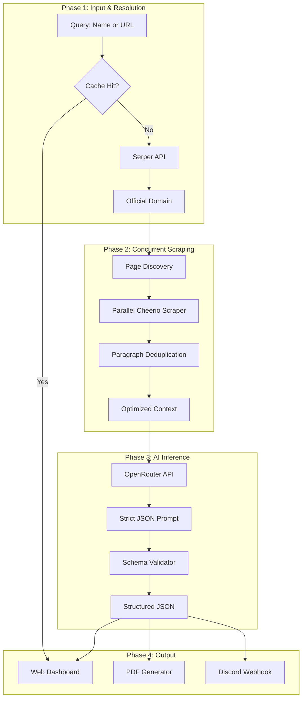

# AI Company Research Assistant

[](https://nextjs.org/)
[](https://reactjs.org/)
[](LICENSE)

An automated company intelligence application built for the **Relu Consultancy AI & Automation Developer Challenge**. 

This system automates market research by converting a company name or website URL into a structured report. The pipeline handles domain resolution, concurrent web scraping, unstructured data deduplication, and LLM-driven insight extraction to synthesize competitive intelligence.

---

## System Workflow & Architecture

The application is structured into four primary data phases:

1. **Resolution**: Accepts a company name (e.g., `"Stripe"`) or URL (`"https://stripe.com"`) and uses the Serper search API with custom heuristics to identify the primary official domain.
2. **Data Extraction**: Concurrently crawls key high-signal subpages (`/about`, `/products`, `/solutions`, `/pricing`) using Cheerio.
3. **AI Reasoning**: deduplicates unstructured text using a string-hashing algorithm to optimize the context window, then passes it to an LLM via OpenRouter. A strict JSON schema prompt forces structured extraction of products, target pain points, and competitor analysis.
4. **Delivery**: Presents the output in the web dashboard, formats a downloadable PDF using `html2pdf.js`, and optionally dispatches the generated report to a configured Discord channel via the Discord REST API.



---

## Technical Implementations & Trade-offs

| Component | Implementation | Engineering Rationale |
| :--- | :--- | :--- |
| **Domain Resolution** | Search result filtering logic prioritizing official domains over directories or news articles. | Reduces LLM hallucination by restricting input context to primary sources. |
| **Web Scraping** | Cheerio DOM parsing executed concurrently via `Promise.allSettled`. | Headless browsers (Puppeteer) introduce significant memory overhead and cold starts in serverless environments. Cheerio provides lower latency at the cost of missing client-side rendered SPA content. |
| **Token Optimization** | 32-bit string hashing to identify and strip repeated header/footer boilerplate across crawled pages. | Reduces context window usage and decreases inference costs/latency. |
| **Output Structuring** | System prompts enforcing a rigid JSON schema with explicit negative rules. | Ensures reliable parsing of AI outputs for the UI and PDF layout. |
| **PDF Generation** | Off-screen, unstyled HTML component mapped to `html2pdf.js`. | Direct screen capturing of dark-mode UI components yields poor print results. The off-screen template enforces standard typography and page breaks. |
| **Discord Integration** | Next.js API Route interacting with the Discord v10 REST API via `FormData`. | Server-side execution keeps the Discord Bot Token secure and handles multipart PDF buffer attachments cleanly. |

---

## Tech Stack

* **Frontend**: Next.js 16.2 (App Router), React 19, CSS Modules
* **Scraping**: Cheerio, Axios
* **Search Sourcing**: Serper.dev API
* **AI Provider**: OpenRouter API
* **PDF Export**: html2pdf.js

---

## Setup & Installation

### Prerequisites

* Node.js v18.0.0+
* npm v9.0.0+

### Local Setup

1. **Clone the Repository**
   ```bash
   git clone https://github.com/sushantkothari/ai-company-research-assistant.git
   cd ai-company-research-assistant
   ```

2. **Install Dependencies**
   ```bash
   npm install
   ```

3. **Environment Configuration**
   ```bash
   cp .env.example .env.local
   ```
   Provide default API keys in `.env.local` (Keys can also be configured dynamically in the UI).
   ```env
   OPENROUTER_API_KEY=your_openrouter_api_key_here
   SERPER_API_KEY=your_serper_api_key_here
   ```

4. **Launch Application**
   ```bash
   npm run dev
   ```
   Navigate to `http://localhost:3000`.

---

## Known Limitations

- **Client-Side Rendering (SPA) Dependency**: The current scraping pipeline uses Cheerio for static HTML parsing. Target websites that require JavaScript execution to render content will return minimal text data.
- **Discord Attachment Size Limits**: Discord imposes an 8MB (or 25MB depending on server tier) limit on attachments. Generated PDFs typically range from 100KB-500KB, but exceptionally large reports could theoretically hit this limit and require external hosting links instead of direct attachments.
- **Context Window Overflows**: While the application deduplicates HTML text, extremely large corporate sites may still exceed the context window of smaller LLMs. A vector database or BM25 chunking strategy would be required for robust large-scale indexing.

---

## License

Distributed under the MIT License. See `LICENSE` for details.
