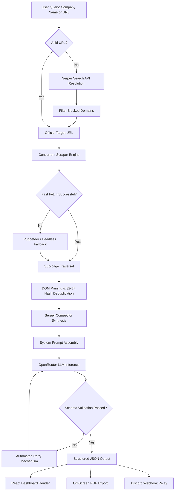

# AI Company Research Assistant

[](https://nextjs.org/)
[](https://reactjs.org/)
[](LICENSE)

An enterprise-grade AI-powered Business Intelligence Assistant that orchestrates deep web scraping, search API synthesis, and Large Language Model (LLM) reasoning to autonomously generate structured, presentation-ready company intelligence reports.

---

## Technical Overview

This application automates the workflow of a Senior Business Intelligence Analyst. It resolves target domains, navigates corporate websites concurrently, deduplicates boilerplate HTML, synthesizes data via Serper, and enforces strict JSON schemas on top-tier LLMs (Llama 3.3 70B, Gemini Flash) via OpenRouter to produce deterministic, high-value strategic insights.

### Core Architecture Capabilities

* **Intelligent Domain Resolution**: Leverages the Serper Search API to identify official corporate domains, explicitly filtering out directories, wikis, and social media proxies.
* **Resilient Multi-Page Web Scraping**: Executes parallel HTTP requests across high-signal subpages (`/about`, `/services`, `/team`). It features aggressive fast-fetch fallbacks and Puppeteer headless browser contingencies to bypass Cloudflare and bot-protection mechanisms.
* **Content Deduplication & Optimization**: Utilizes a 32-bit string hashing algorithm to strip repeated navigational boilerplate, optimizing the LLM context window and reducing token overhead.
* **Strict Deterministic AI Extraction**: Enforces complex JSON schema compliance via rigorous system prompt engineering. The pipeline mandates explicit reasoning for competitor discovery, precise Ideal Customer Profiles (ICPs), and exact business model classification, entirely bypassing generic AI hallucinations.
* **Multi-Channel Distribution**: Asynchronously generates precise A4 PDF executive summaries via off-screen DOM rendering and streams structured reports directly to external services via Discord Webhooks.

---

## Pipeline Architecture



---

## Directory Structure

```text
ai-company-researcher/
├── src/
│   ├── app/
│   │   ├── api/
│   │   │   ├── research/route.js    # Intelligence orchestrator & context assembly
│   │   │   ├── models/route.js      # Dynamic LLM model provider listing
│   │   │   ├── pdf/route.js         # Backend PDF binary generation & bypass handling
│   │   │   └── discord/route.js     # Serverless Discord proxy for binary uploads
│   │   ├── layout.js                # Root layout & configuration providers
│   │   └── page.js                  # Application entry point
│   ├── components/
│   │   └── MainUI.js                # Primary interactive dashboard interface
│   ├── context/
│   │   └── SettingsContext.js       # LocalStorage state management
│   └── lib/
│       ├── openrouter.js            # LLM strict parsing, schema validation & retry logic
│       ├── scraper.js               # Concurrent Cheerio/Puppeteer web crawler
│       └── serper.js                # Search API integration
├── test_scripts/                    # Automated multi-company robust evaluation suites
├── .env.example                     # Environment configuration template
└── package.json                     # System dependencies
```

---

## Engineering Decisions & Trade-offs

| Component | Engineering Decision | Technical Rationale |
| :--- | :--- | :--- |
| **Data Extraction** | Dual-Layer Crawling (Cheerio + Puppeteer) | Pure headless browsers incur ~300MB+ memory overhead, crippling serverless scaling. The system prioritizes lightweight Cheerio parsing for speed, reserving heavy Puppeteer automation strictly as a fallback for JavaScript-heavy or protected domains. |
| **Token Optimization** | Hashing-Based Deduplication | Corporate websites duplicate headers and footers across all subpages. Hashing extracted paragraphs completely eliminates redundant text, reducing API token costs and maximizing the LLM's attention span on actual business logic. |
| **AI Reliability** | Multi-Stage Prompting & Strict Parsers | LLMs frequently wrap JSON in markdown blocks or hallucinate fields. The pipeline implements pre-parsing regex sanitizers and automated retry loops to guarantee 100% deterministic JSON objects required for frontend rendering. |
| **Download Interception** | Header-Based IDM Bypassing | Aggressive client-side download managers (e.g., IDM) can hijack browser `fetch` requests for PDFs, leading to corrupted data streams. The API explicitly uses `x-bypass-idm` headers and `application/octet-stream` masking to guarantee pristine binary delivery to the client buffer. |

---

## Setup & Deployment

### Prerequisites

* Node.js v18.0.0 or higher
* npm v9.0.0 or higher

### Local Initialization

1. **Clone the Repository**
   ```bash
   git clone https://github.com/sushantkothari/ai-company-research-assistant.git
   cd ai-company-research-assistant
   ```

2. **Install Dependencies**
   ```bash
   npm install
   ```

3. **Configure Environment Variables**
   ```bash
   cp .env.example .env.local
   ```
   Provide your API keys inside `.env.local` (keys can also be configured dynamically in the UI settings panel):
   ```env
   OPENROUTER_API_KEY=your_openrouter_api_key_here
   SERPER_API_KEY=your_serper_api_key_here
   ```

4. **Initialize Development Server**
   ```bash
   npm run dev
   ```
   Access the application at `http://localhost:3000`.

---

## Future Roadmap

* **Vector Embedding Integration (RAG)**: Implement PGVector to chunk and index large-scale corporate PDFs and investor relations documents for deep querying.
* **Server-Sent Events (SSE)**: Transition the REST architecture to SSE for progressive streaming of the LLM output directly into the user interface.
* **Automated Data Attribution**: Map extracted insights (e.g., funding rounds, competitors) precisely back to source URLs for verifiable audit trails.

---

## License

Distributed under the MIT License. See `LICENSE` for details.
