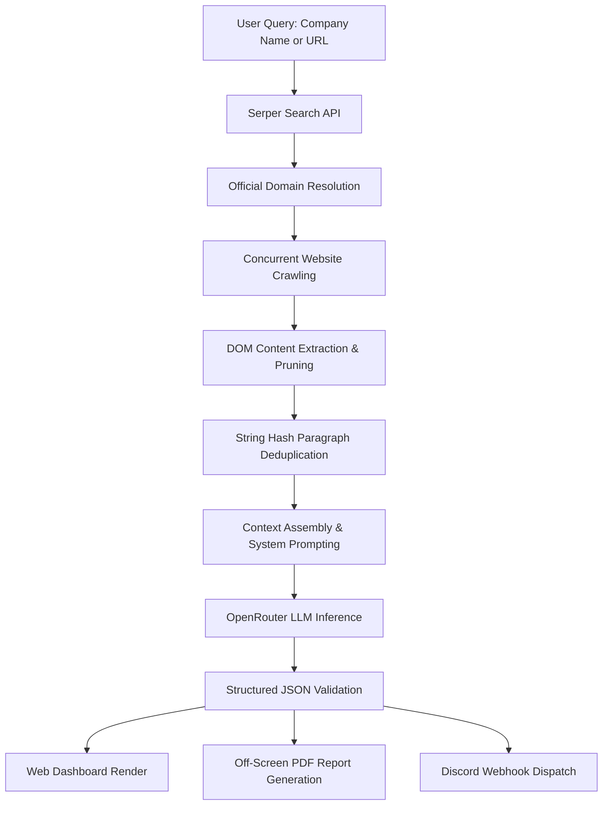

# AI Company Research Assistant

[](https://nextjs.org/)
[](https://reactjs.org/)
[](LICENSE)

An AI-powered Company Research Assistant that combines intelligent web crawling, search APIs, LLM reasoning, and workflow automation to generate structured company intelligence reports.

---

## AI Engineering Highlights

* **Official Domain Resolution**: Uses Serper Search API with domain-filtering heuristics to resolve target corporate websites while filtering out directories, social media profiles, and third-party news sources.
* **Concurrent Scraping & Content Deduplication**: Executes parallel HTTP requests to high-signal subpages (`/about`, `/products`, `/solutions`, `/pricing`) with a 32-bit string hashing algorithm to strip repeated boilerplate and optimize context window usage.
* **Deterministic Structured Extraction**: Enforces strict JSON schema output via system prompt engineering and raw JSON parsing to guarantee deterministic data structures for dashboard rendering and PDF generation.
* **Context Window Optimization**: Prunes irrelevant DOM nodes (`<nav>`, `<footer>`, `<script>`, `<style>`) and caps per-page text lengths to preserve token space for high-value business insights.
* **Multi-Channel Automation**: Formats generated insights into downloadable A4 executive PDF reports and dispatches structured reports asynchronously to configured Discord channels via Discord's REST API.

---

## Architecture Pipeline



---

## Project Structure

```
ai-company-researcher/
├── src/
│   ├── app/
│   │   ├── api/
│   │   │   ├── research/route.js    # Core research orchestrator & LRU cache
│   │   │   └── discord/route.js     # Serverless Discord bot integration
│   │   ├── globals.css              # CSS variables & typography tokens
│   │   ├── layout.js                # Root layout & context providers
│   │   └── page.js                  # Application entry page
│   ├── components/
│   │   ├── MainUI.js                # Dashboard interface & off-screen PDF template
│   │   └── MainUI.module.css        # Responsive CSS module styles
│   ├── context/
│   │   └── SettingsContext.js       # LocalStorage state management
│   └── lib/
│       ├── openrouter.js            # LLM orchestration & schema validation
│       ├── scraper.js               # Concurrent Cheerio crawler & text deduplicator
│       └── serper.js                # Serper Search API integration
├── .env.example                     # Template for environment variables
├── package.json                     # Node.js dependencies and scripts
└── README.md                        # Technical documentation
```

---

## Technical Trade-offs & Engineering Decisions

| Component | Engineering Decision | Technical Rationale |
| :--- | :--- | :--- |
| **Scraping Architecture** | Cheerio DOM Parsing vs. Headless Browsers | Headless browsers (Puppeteer) incur ~300MB+ memory overhead and cold-start latency per request, making them unsuitable for serverless deployments. Cheerio parses HTML in milliseconds while maintaining full edge deployment compatibility. |
| **Context Preparation** | 32-Bit String Hashing Deduplication | Modern corporate websites repeat header, navigation, and footer content across subpages. Tracking paragraph hashes eliminates duplicate text, cutting prompt token overhead by up to ~40%. |
| **Structured Generation** | System Prompts with Schema Restrictions | Passing negative constraints (e.g., prohibiting markdown fences and backticks) ensures clean `JSON.parse` execution without requiring complex regular expression recovery logic. |
| **Document Export** | Dedicated Off-Screen HTML Template | Running `html2canvas` directly on dark-mode web dashboards produces poor print results. Rendering a dedicated, unstyled A4 off-screen component enforces standard typography, margins, and explicit page breaks. |
| **Discord Integration** | Serverless Next.js Proxy Route | Relaying webhook requests through a backend route prevents exposure of Discord bot credentials on the client and manages multipart PDF buffer creation securely. |

---

## Tech Stack

* **Frontend**: Next.js 16.2 (App Router), React 19, CSS Modules
* **AI Orchestration**: OpenRouter API
* **Search Sourcing**: Serper.dev API
* **HTML Parsing & Web Scraping**: Cheerio, Axios
* **Document Generation**: html2pdf.js

---

## Setup & Installation

### Prerequisites

* Node.js v18.0.0 or higher
* npm v9.0.0 or higher

### Local Setup

1. **Clone the Repository**
   ```bash
   git clone https://github.com/sushantkothari/ai-company-research-assistant.git
   cd ai-company-research-assistant
   ```

2. **Install Dependencies**
   ```bash
   npm install
   ```

3. **Configure Environment Variables**
   ```bash
   cp .env.example .env.local
   ```
   Add your API keys to `.env.local` (keys can also be configured dynamically in the UI settings panel):
   ```env
   OPENROUTER_API_KEY=your_openrouter_api_key_here
   SERPER_API_KEY=your_serper_api_key_here
   ```

4. **Run Development Server**
   ```bash
   npm run dev
   ```
   Open `http://localhost:3000` in your browser.

---

## Future Improvements

* **Playwright Fallback Integration**: Implement a secondary browser automation pipeline to render single-page applications (SPAs) that depend heavily on client-side JavaScript.
* **Vector Embedding & RAG Pipeline**: Introduce document chunking with vector embeddings (e.g., PGVector/Pinecone) to enable deep multi-page querying across large corporate domains.
* **Response Streaming**: Implement Server-Sent Events (SSE) to stream research steps and LLM outputs progressively to the web interface.
* **Fact Attribution & Source Mapping**: Add inline link citations mapping extracted pain points and competitor metrics directly to source URLs.
* **Adaptive Crawl Strategy**: Dynamically analyze sitemaps to prioritize high-value pages based on link depth and page metadata.

---

## License

Distributed under the MIT License. See `LICENSE` for details.
