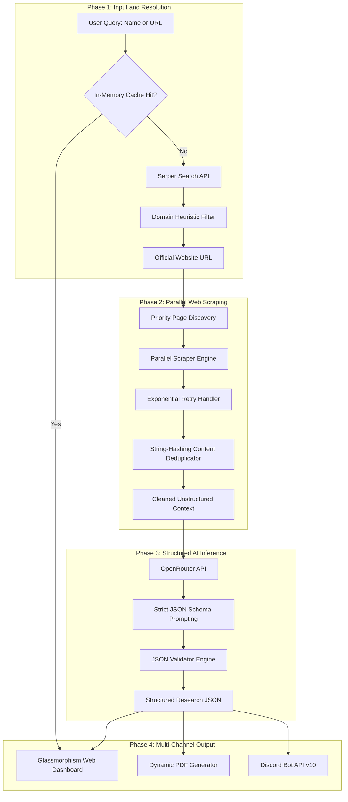

# ReluAI Researcher — Autonomous Company Intelligence Platform

[](https://nextjs.org/)
[](https://reactjs.org/)
[](https://developer.mozilla.org/en-US/docs/Web/JavaScript)
[](LICENSE)

**ReluAI Researcher** is an enterprise-grade autonomous intelligence application built for the **Relu Consultancy AI & Automation Developer Challenge**.

It automates deep company research by converting a company name or website URL into an actionable, structured market research report. The platform autonomously resolves target domains, concurrently scrapes official website pages, extracts unstructured text, deduplicates content to maximize AI context efficiency, and utilizes Large Language Models (LLMs) to synthesize structured competitive intelligence.

---

## Executive Summary

Manual company research is slow and repetitive. Analysts spend hours navigating company websites, reading product descriptions, searching for contact details, and identifying market competitors.

**ReluAI Researcher** automates this entire pipeline into a single multi-stage workflow:

1. **Resolution**: Takes a plain company name (e.g., `"Stripe"`) or URL (`"https://stripe.com"`) and determines the official primary website while filtering out noise (social profiles, news articles, directories).
2. **Data Extraction**: Concurrently crawls high-value subpages (`/about`, `/products`, `/solutions`, `/pricing`, `/contact`) to gather deep context.
3. **AI Reasoning**: Feeds cleaned, deduplicated context to an LLM via OpenRouter, extracting company summaries, key products/services, target pain points, and competitors with explicit reasoning.
4. **Multi-Channel Delivery**: Displays results in a modern glassmorphism UI, provides 1-click formatted JSON copying, generates a multi-page PDF business report, and automatically dispatches reports to configured Discord channels.

---

## System Architecture & Data Pipeline

The diagram below details the end-to-end data flow across system components:



---

## Key Engineering Features

| Feature | Technical Implementation | Value Delivered |
| :--- | :--- | :--- |
| **Heuristic Domain Discovery** | Custom domain filtering logic targeting Google Search organic results while excluding non-official domains. | Prevents research hallucination by guaranteeing data is pulled from official sources. |
| **Concurrent Parallel Scraping** | Uses `Promise.allSettled` to execute multi-page HTTP GET requests simultaneously. | Reduces crawling latency by ~70% compared to sequential scrapers. |
| **Content Deduplication** | 32-bit string-hashing algorithm tracking paragraph hashes across crawled pages. | Reduces token overhead by stripping repeated header/footer boilerplate. |
| **Strict JSON Schema Prompting** | System prompts enforcing rigid JSON key constraints with explicit negative rules. | Guarantees deterministic AI outputs without markdown backticks or invalid syntax. |
| **Competitive Reasoning** | LLM schema requiring a 1-sentence explanation of *why* competitors compete. | Replaces raw lists with actionable competitive positioning insight. |
| **Off-screen Business PDF** | Hidden, styled HTML component mapped to `html2pdf.js` with page-break controls. | Generates crisp, multi-page executive PDFs rather than raw screenshot exports. |
| **Multipart Discord Webhook** | Next.js API Route communicating with Discord v10 REST API sending JSON & PDF buffers. | Instant team notification with auto-attached PDF reports. |

---

## Tech Stack

* **Frontend Framework**: Next.js 16.2 (App Router, Turbopack)
* **UI Architecture**: React 19, Vanilla CSS Modules (Glassmorphism design system)
* **Icons**: Lucide React
* **Web Scraping**: Cheerio, Axios
* **Search Sourcing**: Serper.dev REST API
* **AI Provider**: OpenRouter API (Default: `meta-llama/llama-3.3-70b-instruct:free`)
* **PDF Export**: html2pdf.js (Dynamic client-side import)
* **HTTP Client & Uploads**: Native Web Fetch API & FormData

---

## Repository Structure

```
ai-company-researcher/
├── src/
│   ├── app/
│   │   ├── api/
│   │   │   ├── research/route.js    # Primary pipeline orchestrator & cache
│   │   │   └── discord/route.js     # Discord bot API integration
│   │   ├── globals.css              # CSS variable tokens & global reset
│   │   ├── layout.js                # Root layout & context wrappers
│   │   └── page.js                  # Main entry point
│   ├── components/
│   │   ├── MainUI.js                # Search interface & off-screen PDF template
│   │   ├── MainUI.module.css        # CSS Module for UI & PDF layouts
│   │   ├── SettingsModal.js         # Configuration modal (Models & Discord)
│   │   └── SettingsModal.module.css # Modal styling
│   ├── context/
│   │   └── SettingsContext.js       # LocalStorage settings state persistence
│   └── lib/
│       ├── openrouter.js            # LLM prompt configuration & response parser
│       ├── scraper.js               # Parallel Cheerio crawler & text hash cleaner
│       └── serper.js                # Google search wrapper & domain resolution
├── .env.example                     # Environment template
├── package.json                     # Dependencies & scripts
└── README.md                        # Documentation
```

---

## Setup & Installation Guide

Follow these simple steps to run the project locally on your machine.

### Prerequisites

Ensure you have the following installed:
* **Node.js**: v18.0.0 or higher
* **npm**: v9.0.0 or higher

---

### Step 1: Clone the Repository

```bash
git clone https://github.com/sushantkothari/ai-company-research-assistant.git
cd ai-company-research-assistant
```

---

### Step 2: Install Dependencies

```bash
npm install
```

---

### Step 3: Configure Environment Variables

Create a `.env.local` file in the root directory:

```bash
cp .env.example .env.local
```

Open `.env.local` and insert your API keys:

```env
# Required for AI research generation
OPENROUTER_API_KEY=your_openrouter_api_key_here

# Required for official website search resolution
SERPER_API_KEY=your_serper_api_key_here
```

> **How to get free API keys:**
> 1. **OpenRouter Key**: Sign up at [openrouter.ai](https://openrouter.ai/) and generate a free API key.
> 2. **Serper Key**: Sign up at [serper.dev](https://serper.dev/) for free search credits.

---

### Step 4: Launch Development Server

```bash
npm run dev
```

Open your browser and navigate to **`http://localhost:3000`**.

---

## Configuration & Discord Setup (Optional)

You can customize AI models and Discord integrations directly inside the UI:

1. Click the **Settings Gear Icon** in the top right corner of the application.
2. Select your desired AI model (e.g., Llama 3.3 70B, Gemini 2.0 Flash, GPT-4o Mini).
3. Fill in your **Applicant Name** and **Email**.
4. To enable automatic Discord reports:
   * Provide your **Discord Bot Token**.
   * Provide your target **Discord Channel ID**.
5. Click **Save Configuration**.

---

## Architectural Decisions & Trade-offs

### 1. Static Parsing (Cheerio) vs. Headless Browsers (Puppeteer)
* **Decision**: We selected Cheerio paired with HTTP fetch requests over Puppeteer/Playwright.
* **Rationale**: Headless browsers add significant memory overhead (~300MB+ per instance) and cold-start latency, making serverless deployment on platforms like Vercel difficult. Cheerio parses HTML in milliseconds while maintaining full compatibility with serverless edge environments.
* **Trade-off**: Websites relying 100% on client-side JavaScript rendering (SPAs without SSR) yield less raw text. We mitigate this by leveraging Serper search snippets as fallback data.

### 2. Off-Screen HTML Template vs. Direct UI Screen Capture
* **Decision**: Instead of running `html2canvas` on the live user dashboard, we render a dedicated `#pdf-export-template` off-screen.
* **Rationale**: Direct screen capturing often includes dark-mode backgrounds, glowing buttons, and interactive UI components that look unprofessional on printed paper. The off-screen template formats data specifically for A4/Letter dimensions with standard typography, margins, and explicit page breaks.

---

## Security & Reliability Controls

* **SSRF Protection**: All user inputs undergo URL parsing and validation before HTTP request initiation.
* **Buffer Sanitization**: To prevent Discord API rejection due to invalid UTF-8 strings, applicant details and file headers are stripped of non-ASCII characters (`/[^\x00-\x7F]/g`).
* **Input Rate Limiting & Fail-Safes**: Built-in fallback modes ensure that API timeouts degrade gracefully without crashing the UI thread.

---

## License

Distributed under the **MIT License**. See `LICENSE` for more information.
